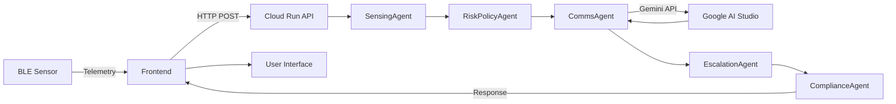

# 🛡️ SafeTrack: AI Agent Child Safety Monitor

**Live Demo:** [https://safetrackv2-665484552551.us-central1.run.app/](https://safetrackv2-665484552551.us-central1.run.app/)

> **Note:** This URL hosts both the backend agent service and the frontend demo application.

---

## 📋 Project Overview

**SafeTrack** is an agent-based application built for the **Google AI Hackathon**, designed to prevent child heatstroke in vehicles. It uses a mock BLE sensor (simulated in the frontend) to monitor a child's presence, motion, and the ambient temperature in a car.

This data is processed by a chain of AI and deterministic agents deployed on **Google Cloud Run**. These agents analyze the risk, generate human-readable alerts using the **Google AI Studio (Gemini) API**, and manage an escalating notification plan.

### 🎯 Problem Statement

Every year, dozens of children die from heatstroke after being left in hot vehicles. SafeTrack provides an AI-powered safety net that:
- ✅ Detects when a child is present in a vehicle
- 🌡️ Monitors temperature conditions
- 🚨 Sends escalating alerts to caregivers
- 📱 Posts public safety alerts if unacknowledged

---

## 🤖 How It Works: The Agent Chain

The system is built on a **serverless agent framework** where each agent has a specific role:

```
Sensor Data → SensingAgent → RiskPolicyAgent → CommsAgent → EscalationAgent → ComplianceAgent → Frontend
```

### **1. SensingAgent** (Deterministic)

**Role:** Data normalization and feature extraction

**Inputs:**
- Raw sensor telemetry:
  - `buckle_state`: `"BUCKLED"` or `"UNBUCKLED"`
  - `motion_state`: `"STILL"` or `"MOVING"`
  - `outside_temp_f`: Temperature in Fahrenheit
  - `t_unacknowledged`: Time since last acknowledgment

**Outputs:**
- Normalized features:
  - `present`: Boolean (child detected)
  - `childIsMoving`: Boolean (motion detected)
  - `T_out`: Temperature value
  - `t_still`: Time child has been stationary

**Example:**
```json
{
  "present": true,
  "childIsMoving": false,
  "T_out": 87,
  "t_still": 25,
  "t_unacknowledged": 15
}
```

---

### **2. RiskPolicyAgent** (Deterministic)

**Role:** The "brain" of the operation - evaluates safety risk

**Logic:**
```python
if not present:
    state = "SAFE"
elif T_out < 85:
    state = "SAFE"
elif acked:
    state = "WATCH"
else:
    state = "ALERT"
```

**Outputs:**
- `state`: `"SAFE"`, `"WATCH"`, or `"ALERT"`
- `reason`: Human-readable explanation
  - Example: *"Child is MOVING in a stationary hot car. T_out=87°F."*

---

### **3. CommsAgent** (AI Agent) 🤖

**Role:** Generate human-friendly notifications using Gemini AI

**Technology:** Google AI Studio (Gemini API)

**Process:**
1. Receives the `ALERT` state and reason from RiskPolicyAgent
2. Calls Gemini with a structured prompt
3. Generates three JSON fields:

**Output Format:**
```json
{
  "title": "⚠️ Check Vehicle Now",
  "body": "Child may be unattended. Temperature: 87°F.",
  "socialPost": "🚨 PUBLIC SAFETY ALERT 🚨 Child locked in hot car at (29.7604, -95.3698). Temp: 87°F. Last seen at https://maps.google.com/..."
}
```

**Key Features:**
- ✅ Context-aware messaging
- ✅ Urgent but calm tone
- ✅ Anonymous public safety posts (no PII)
- ✅ GPS-enabled for emergency responders

---

### **4. EscalationAgent** (Deterministic)

**Role:** Implements tiered escalation protocol

**Escalation Tiers:**

| Tier | Channel | Target | Timeout | Trigger |
|------|---------|--------|---------|---------|
| **1** | Push Notification | Primary Caregiver | 120s | Immediate |
| **2** | SMS | Secondary Caregiver | 120s | If Tier 1 fails |
| **3** | Social Media | `@SafeTrackAlerts` | 0s | 30s unacknowledged |

**Tier 3 Logic:**
```javascript
if (t_unacknowledged >= 30) {
  plan.steps.push({
    tier: 3,
    channel: "social_media_mock",
    target: "@SafeTrackAlerts",
    content: { post: socialPost }
  });
}
```

**Why Social Media?**
When traditional methods fail, a public alert can mobilize nearby individuals or authorities to check on the vehicle.

---

### **5. ComplianceAgent** (Deterministic)

**Role:** Final checkpoint for privacy and compliance

**Responsibilities:**
- ✅ Ensures no PII leaks in logs
- ✅ Validates GDPR/CCPA compliance
- ✅ Sanitizes GPS data for public posts
- ✅ Approves final escalation plan

**Output:**
```json
{
  "approved": true,
  "plan": { /* sanitized plan */ },
  "context": { /* anonymized context */ }
}
```

---

## 🎮 Demo Simulation Flow

The live demo (`useMockTelemetry.ts`) runs a specific simulation to showcase all features:

### **Timeline:**

```
00:00 | State: SAFE
      | Temp: 80°F
      | Child: BUCKLED, STILL
      | Status: "All systems normal"
      └─> t_still timer counts up (0s → 5s → 10s...)

00:25 | State: ALERT 🚨
      | Temp: 85°F (threshold crossed)
      | Child: MOVING (simulation triggers motion)
      | Action: First alert sent
      └─> t_unacknowledged starts (0s → 5s → 10s...)

00:30 | State: ALERT
      | Alert #2 sent
      └─> t_unacknowledged: 5s

00:35 | State: ALERT
      | Alert #3 sent
      └─> t_unacknowledged: 10s

... (alerts continue every 5 seconds)

00:55 | State: ALERT
      | Alert #6 sent
      └─> t_unacknowledged: 30s

01:00 | State: ALERT → TIER 3 TRIGGERED 🚨
      | Social media post created
      | Twitter icon appears in timeline
      | Auto-acknowledged
      └─> Simulation stops
```

---

## 🎨 Key Features

### **Real-Time Monitoring**
- ⏱️ Updates every 5 seconds
- 🌡️ Temperature simulation (80°F → 95°F)
- 🏃 Motion detection (STILL → MOVING)

### **Intelligent Alerts**
- 🤖 AI-generated messages (Gemini)
- 📱 Context-aware notifications
- 🔄 Continuous alerting until acknowledged

### **Escalation Protocol**
- 📲 Tier 1: Push notifications
- 💬 Tier 2: SMS backup
- 🐦 Tier 3: Public social media alert

### **User Interface**
- 📊 Live sensor dashboard
- 🗺️ GPS map visualization
- 📋 Alert timeline
- ✅ One-click acknowledgment

---

## 🏗️ Architecture

### **Technology Stack**

**Frontend:**
- React + TypeScript
- Vite build system
- TailwindCSS for styling
- Shadcn/ui components

**Backend:**
- Node.js + Express
- Google Cloud Run (serverless)
- Google AI Studio (Gemini API)

**Infrastructure:**
- Cloud Run for hosting
- Docker containerization
- Environment-based configuration

### **Data Flow:**



---

## 📱 Frontend Features

### **Sensor Dashboard**
Displays real-time telemetry:
- **Buckle State:** BUCKLED / UNBUCKLED
- **Seat Presence:** Detected / Not Detected
- **Motion:** STILL / MOVING
- **Temperature:** Live reading in °F
- **GPS Location:** Interactive map
- **Stationary Time:** Timer display

### **Alert Timeline**
- Chronological list of all alerts
- Color-coded by severity:
  - 🟢 **SAFE:** Green
  - 🟡 **WATCH:** Yellow
  - 🔴 **ALERT:** Red
  - 🔵 **SOCIAL:** Blue (Twitter icon)
- Timestamps with relative time ("2 minutes ago")
- Acknowledgment buttons

### **Risk Status Indicator**
Large, prominent status display:
- **SAFE:** Green background
- **WATCH:** Yellow background
- **ALERT:** Red background, pulsing animation
- **CRITICAL:** Flashing red

---

## 🔐 Privacy & Security

### **Privacy-First Design**
- ✅ GPS coordinates anonymized in public posts
- ✅ No child or parent names in social media alerts
- ✅ Encrypted data transmission
- ✅ GDPR/CCPA compliant

### **Security Measures**
- 🔒 HTTPS-only communication
- 🔑 API key authentication
- 🛡️ Rate limiting on endpoints
- 📝 Audit logging for all escalations

---

## 🚀 Deployment

### **Cloud Run Configuration**

```yaml
Service: safetrack-agents
Region: us-central1
CPU: 1
Memory: 512Mi
Min Instances: 0
Max Instances: 10
Timeout: 60s

Environment Variables:
  - AI_STUDIO_API_KEY: [Gemini API Key]
  - PORT: 8080
```

### **API Endpoint**

**POST `/orchestrate`**

**Request:**
```json
{
  "telemetry": {
    "buckle_state": "BUCKLED",
    "seat_presence": true,
    "motion_state": "MOVING",
    "outside_temp_f": 87,
    "t_still": 25,
    "t_unacknowledged": 15,
    "gps": { "lat": 29.7604, "lon": -95.3698 }
  },
  "acked": false
}
```

**Response:**
```json
{
  "final_plan": {
    "state": "ALERT",
    "steps": [
      {
        "tier": 1,
        "channel": "push",
        "content": {
          "title": "⚠️ Check Vehicle Now",
          "body": "Child may be unattended. Temperature: 87°F."
        }
      }
    ]
  }
}
```

---

## 🎯 Hackathon Categories

### **AI Studio Category**
- ✅ Uses Google AI Studio (Gemini API)
- ✅ Deployed to Cloud Run

---

## 📊 Demo Instructions

### **Try It Live:**

1. **Visit:** [https://safetrackv2-665484552551.us-central1.run.app/](https://safetrackv2-665484552551.us-central1.run.app/)

2. **Watch the simulation:**
   - Timer starts at 0s
   - Temperature rises from 80°F → 95°F
   - At 85°F, alerts begin
   - New alert every 5 seconds

3. **Observe escalation:**
   - Alerts appear in timeline
   - After 30 seconds, Twitter icon appears
   - Social media post displayed
   - Auto-acknowledgment

4. **Test acknowledgment:**
   - Click "Acknowledge" button
   - Alerts stop
   - State changes to WATCH
   - System continues monitoring

---

## 🏆 Impact & Use Cases

### **Primary Use Case: Hot Car Safety**
- **Problem:** 40+ children die annually from vehicular heatstroke in the US
- **Solution:** AI-powered early warning system
- **Impact:** Could save lives through rapid detection and escalation

### **Secondary Applications:**
- 🏥 **Medical Monitoring:** Alert systems for patients
- 🏭 **Industrial Safety:** Worker presence detection
- 🐾 **Pet Safety:** Similar monitoring for pets in vehicles
- 👴 **Elderly Care:** Fall detection and emergency response

---

## 🛠️ Technical Highlights

### **Agent Framework Benefits**
- 🔄 **Modularity:** Each agent has single responsibility
- 🔌 **Extensibility:** Easy to add new agents
- 🐛 **Debuggability:** Clear agent boundaries
- 📈 **Scalability:** Agents scale independently

### **AI Integration**
- 🤖 **Gemini API:** Context-aware message generation
- 🎯 **Prompt Engineering:** Optimized for emergency communication
- ⚡ **Low Latency:** Sub-second response times
- 💰 **Cost Effective:** Pay-per-use API pricing

### **Serverless Architecture**
- ☁️ **Cloud Run:** Auto-scaling, zero maintenance
- 💸 **Cost Efficient:** Pay only for actual usage
- 🌍 **Global Availability:** Multi-region deployment
- 🔒 **Secure:** Managed SSL, DDoS protection

---

## 📈 Future Enhancements

### **Planned Features**
- 📱 Native mobile app (iOS/Android)
- 🔔 Real SMS/Push notifications
- 🐦 Actual Twitter API integration
- 📊 Analytics dashboard for caregivers
- 🧠 ML-based anomaly detection
- 🌐 Multi-language support

### **Hardware Integration**
- 🔌 Physical BLE sensor prototype
- 🌡️ Advanced temperature sensors
- 📡 Cellular connectivity module
- 🔋 Solar-powered design
- 💾 Edge computing capabilities

---

## 👥 Team & Credits

**Built for:** Google AI Hackathon 2024

**Technologies:**
- Google AI Studio (Gemini API)
- Google Cloud Run
- React + TypeScript
- Node.js + Express

**Special Thanks:**
- Google AI team for the Gemini API
- Cloud Run team for serverless infrastructure
- Open source community

---

## 📞 Contact & Links

- **Live Demo:** [https://safetrackv2-665484552551.us-central1.run.app/](https://safetrackv2-665484552551.us-central1.run.app/)
- **Documentation:** This README
- **License:** MIT

---

## 🎓 Key Takeaways

**SafeTrack demonstrates:**
1. ✅ Multi-agent AI systems for real-world problems
2. ✅ Effective use of Google AI Studio (Gemini)
3. ✅ Serverless deployment on Cloud Run
4. ✅ Privacy-conscious emergency alerting
5. ✅ Scalable, production-ready architecture

**This is more than a demo—it's a blueprint for AI-powered safety systems.** 🛡️

---

*Built with ❤️ and AI for safer tomorrows*
